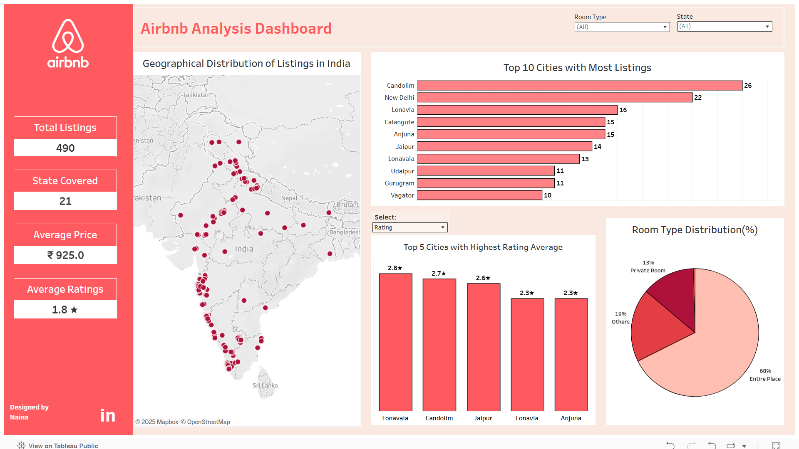

# Airbnb-Analysis-Dashboard
I built an Airbnb Analysis Dashboard using **Excel** and **Tableau** to analyze top cities by listings, average price & rating across cities, room-type distribution and state-wise distribution.

## Dashboard Overview
- **Total Listings:** 490  
- **States Covered:** 21  
- **Average Price:** ₹925  
- **Average Ratings:** 1.8 ★

## Key Insights:
- Higher number of listings are in **Goa**, **Maharashtra**, **Delhi** and **South India**, which means high concentration of listings on heavy tourist place.
- **Candolim(Goa)**, **New Delhi**, and **Lonavala** have the highest number of listings, mostly in popular tourist spots.
- The majority of listings (68%) are for **Entire places**, which indicates that guests prefer full privacy.
- **Jaipur** has the highest average price (₹1854).

##  Tools Used
- **Excel** – for data cleaning and preprocessing  
- **Tableau** – for building the dashboard and visual insights 

##  Dashboard Snapshot

> Viwe the interactive version here.[Tableau Public](https://public.tableau.com/app/profile/naina.sonkar/viz/AirbnbAnalysisDashboard_17459572047050/Dashboard1)
